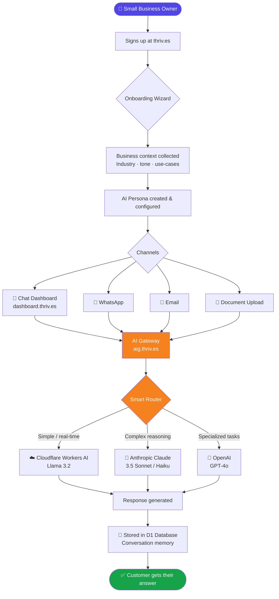

<div align="center">


# thriv.es

**Where potential meets performance**

*AI personas for freelancers and small businesses — built on the edge, open at the core.*

[](https://thriv.es)
[](https://github.com/thriv-es)
[](https://cloudflare.com)
[](https://www.typescriptlang.org/)

</div>

---

## What Is thriv.es?

thriv.es gives freelancers and small business owners their own AI personas — intelligent agents that understand their business, speak in their voice, and actively help them grow.

Think of it as having a tireless business partner who handles customer communication, analyses documents, answers questions on WhatsApp, and surfaces growth opportunities — all without requiring any technical knowledge from the owner.

> *Every business has the potential to thrive. Our AI personas are seeded for that growth.*

---

## How It Works — The Full Flow

A new customer goes from sign-up to their first AI-powered conversation in under 15 minutes.



### Behind the scenes

**1 — Auth layer** (`auth.thriv.es`)  
Every request is gated by a dedicated Cloudflare Worker handling JWT issuance, session management, CSRF protection, and rate limiting.

**2 — AI Gateway** (`aig.thriv.es`)  
The intelligence hub. It routes each message to the optimal LLM (Cloudflare Workers AI for speed, Anthropic Claude for reasoning, OpenAI for specialized tasks), with automatic failover. Prompts are version-controlled and A/B-tested through Langfuse, then synced to the gateway in real time.

**3 — Multi-agent orchestration (LangGraph)**  
Complex business tasks — onboarding, document analysis, growth consulting — are broken into sequential agent steps. Each step has a specialised agent; the results are chained together and surfaced as a single coherent answer.

**4 — Edge-first infrastructure**  
Everything runs on Cloudflare's global edge: Workers for compute, D1 (SQLite at the edge) for conversation state and user data, R2 for file and audio storage, AutoRAG for document retrieval. No servers to manage, infinite scale by default.

---

## Architecture at a Glance

```
thriv.es              →  Marketing site & customer onboarding (Cloudflare Pages + React)
auth.thriv.es         →  Authentication service (Cloudflare Worker + Hono + D1)
aig.thriv.es          →  AI Gateway — multi-LLM routing + prompt management (Worker + D1)
dashboard.thriv.es    →  Customer chat & persona dashboard (React + RedwoodJS + D1)
```

**Core stack:** TypeScript · React · Vite · shadcn/ui · TailwindCSS · Hono · Drizzle ORM · Cloudflare Workers · D1 · R2 · AutoRAG · Langfuse

---

## Who We Build For

| Persona | Who they are | How thriv.es helps |
|---|---|---|
| **Sarah the Solopreneur** | Independent consultants, coaches, fitness trainers | Handles client check-ins, schedules sessions, creates marketing content |
| **Mike the Micro-Business Owner** | Local businesses with 2–10 employees | Consistent customer service across channels, data insights, team coordination |
| **Emma the Creative Entrepreneur** | Designers, marketers, content creators | Proposal generation, lead qualification, client onboarding automation |

---

## Open Source Projects

These repos are public and open for contributions.

### 🧠 [domain-knowledge](https://github.com/thriv-es/domain-knowledge)
The structured knowledge base that powers every thriv.es AI agent — company overview, technical architecture, brand voice, customer personas, and development best practices. All in open XML so any LLM, developer, or contributor knows exactly what they're working with.

### 🎨 [movers](https://github.com/thriv-es/movers)
Shared UI scaffolding monorepo — Vite + shadcn/ui + TailwindCSS in a pnpm workspace. The design system foundation that keeps every thriv.es interface consistent, accessible, and fast.

### 🎙️ [transcriber](https://github.com/thriv-es/transcriber)
AI-powered audio call analysis platform with Hebrew language support. Transcribes, classifies, and surfaces insights from call recordings via a hybrid Cloudflare Workers + R2 architecture. Supports single-file uploads from the browser and bulk processing via a Windows service.

### 📊 [slides-maker](https://github.com/thriv-es/slides-maker)
MCP server that lets you create, edit, and publish presentations just by chatting with Claude. Describe your deck in plain language — get a live shareable URL in seconds. Self-hostable on Cloudflare Workers.

```bash
# Add to Claude Code in 30 seconds
claude mcp add slides-maker --transport http \
  https://slides-maker.thrives.workers.dev/mcp/YOUR_TOKEN
```

### 🖼️ [prompt-builder](https://github.com/thriv-es/prompt-builder)
Modular AI prompt construction tool for image generation and infographics. Pick visual building blocks, watch the prompt assemble in real time, then copy straight to Midjourney, DALL·E, or Stable Diffusion.

---

## Contributing

thriv.es is built transparently. We open-source the pieces that can help the community — and we welcome contributions to all public repos.

1. Fork the repo you want to improve
2. Create a feature branch
3. Submit a pull request

For `domain-knowledge`, follow the guidelines in [`DOCUMENTATION_GUIDELINES.xml`](https://github.com/thriv-es/domain-knowledge/blob/main/DOCUMENTATION_GUIDELINES.xml) to keep the knowledge base consistent.

---

## Team

Collaboratively built by [@assafmashiah](https://github.com/assafmashiah) and [@evilUrge](https://github.com/evilUrge), with gratitude to every contributor along the way.

---

<div align="center">

**[thriv.es](https://thriv.es)** — *Where potential meets performance*

</div>
