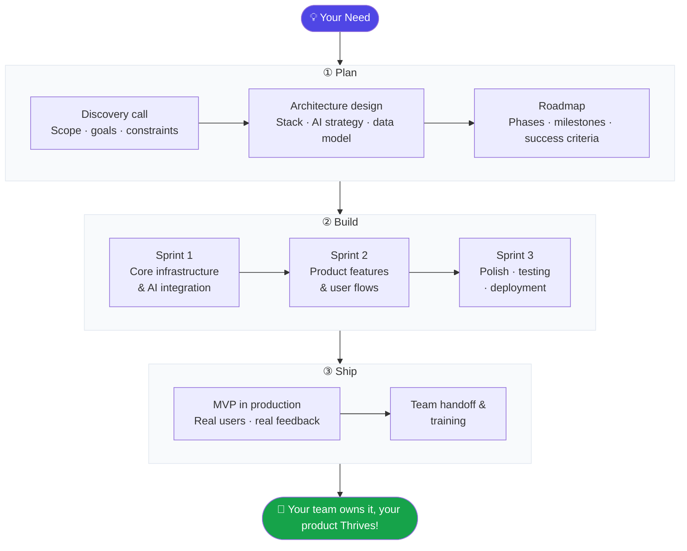

# thriv.es

**Where potential meets performance**

---

## What Is thriv.es?

We build MVPs you can put in front of users.

A studio of practitioners shipping production AI for education and games — and training the teams that need to do the same.

---

## How We Work

### What each phase looks like in practice

**① Plan** — We start with a discovery session to align on the problem, the user, and the constraint that matters most. Then we design the architecture and AI strategy together, so you know exactly what's being built and why before a line of code is written.

**② Build** — We move in fast, focused sprints. Core infra and AI integration first, then product features and user flows, then a final sprint for polish, testing, and production deployment. Everything ships to a real environment — not a demo.

**③ Ship** — The MVP goes in front of real users. We support the handoff, document the system, and train your team so they can own it from day one. If you need us to keep iterating, we're here for that too.

---

## Open Source Projects

We build in the open. Here are some of the tools and systems we've released.

<table>
  <tr>
    <td width="50%" valign="top">
      <h3>🧠 domain-knowledge</h3>
      
The open-source knowledge base powering our AI agents — structured docs covering company, brand, customers, and architecture. Built for transparency: any LLM, developer, or contributor knows exactly what they're working with.

      <a href="https://github.com/thriv-es/domain-knowledge">→ thriv-es/domain-knowledge</a>
        
      
    </td>
    <td width="50%" valign="top">
      <h3>🎨 movers</h3>
      
Shared UI scaffolding monorepo — Vite + shadcn/ui + TailwindCSS in a pnpm workspace. The design system foundation that keeps every interface consistent, accessible, and fast.

      <a href="https://github.com/thriv-es/movers">→ thriv-es/movers</a>
        
      
    </td>
  </tr>
  <tr>
    <td width="50%" valign="top">
      <h3>🎙️ transcriber</h3>
      
AI-powered audio call analysis with Hebrew language support. Transcribes, classifies, and surfaces insights from call recordings via a hybrid Cloudflare Workers + R2 architecture — single-file uploads from the browser, bulk processing via a Windows service.

      <a href="https://github.com/thriv-es/transcriber">→ thriv-es/transcriber</a>
        
      
    </td>
    <td width="50%" valign="top">
      <h3>📊 slides-maker</h3>
      
MCP server that lets you create, edit, and publish presentations just by chatting with Claude. Describe your deck in plain language — get a live shareable URL in seconds. Self-hostable on Cloudflare Workers.

      <a href="https://github.com/thriv-es/slides-maker">→ thriv-es/slides-maker</a>
        
      
  </tr>
  <tr>
    <td width="50%" valign="top">
      <h3>🖼️ prompt-builder</h3>
      
Modular AI prompt construction tool for image generation and infographics. Pick visual building blocks, watch the prompt assemble in real time, then copy straight to Midjourney, DALL·E, or Stable Diffusion.

      <a href="https://github.com/thriv-es/prompt-builder">→ thriv-es/prompt-builder</a>
        
      
    </td>
    <td width="50%" valign="top">
      <!-- future project slot -->
    </td>
  </tr>
</table>

---

## Team

Collaboratively built by [@evilUrge](https://github.com/evilUrge) and [@assafmashiah](https://github.com/assafmashiah), with gratitude to every contributor along the way.

---

**[thriv.es](https://thriv.es)** — *Where potential meets performance*

