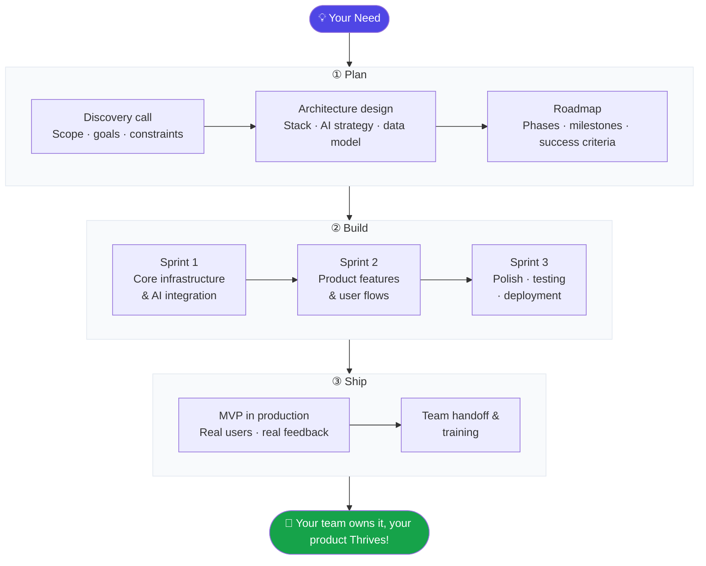

## What Is thriv.es?

We build MVPs you can put in front of users.

A studio of practitioners shipping production AI for education and games — and training the teams that need to do the same.

---

## How We Work

### What each phase looks like in practice

**① Plan** — We start with a discovery session to align on the problem, the user, and the constraint that matters most. Then we design the architecture and AI strategy together, so you know exactly what's being built and why before a line of code is written.

**② Build** — We move in fast, focused sprints. Core infra and AI integration first, then product features and user flows, then a final sprint for polish, testing, and production deployment. Everything ships to a real environment — not a demo.

**③ Ship** — The MVP goes in front of real users. We support the handoff, document the system, and train your team so they can own it from day one. If you need us to keep iterating, we're here for that too.

---

## Team

Collaboratively built by [@evilUrge](https://github.com/evilUrge) and [@assafmashiah](https://github.com/assafmashiah), with gratitude to every contributor along the way.

---

**[thriv.es](https://thriv.es)** — *Where potential meets performance*

